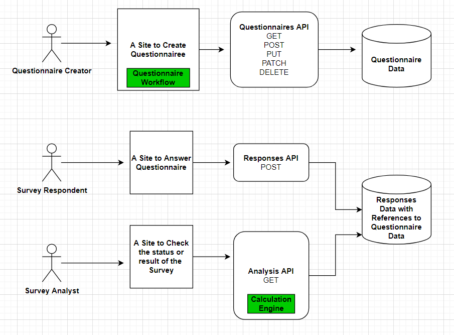
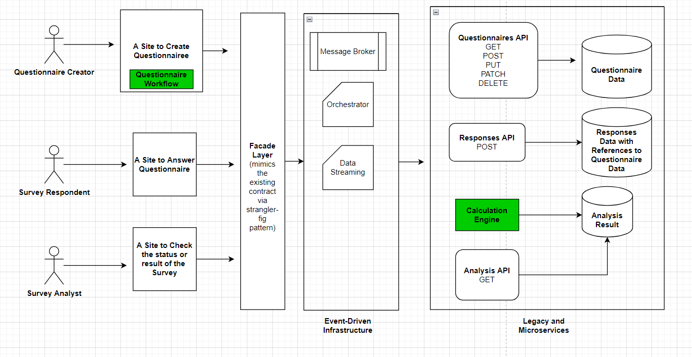

# API Coding Assessment

The REST API solution is built in .NET 6 using minimal API with the following resources:

1. Questionnaires - an API endpoint for getting one or more questions with pagination functionality.
2. Responses - an API endpoint to accept responses for questionnaires. It accepts user information as part of the contract.
3. Analyses - an API endpoint to get questionnaire results and analysis.

### Personal Notes

- Due to time limitation, the developer decided on focusing on the Questionnaires endpoint and deliver its main functionality.
- The developer decided on mocking the other endpoints contract to mimic immediate integration flow whenever a new API is being made. This will also help consumer of the API to integrate first and test the functionality later on.

### Implementation Approach

- I started out on understanding first the data structure provided comparing to the 3 initial requirements.
- I then proceed on modeling come up with 3 main domains namely Questionnaires, Responses and Analyses.
- After this is the implement of the project structure, API bootstrapping and unit tests.

### Some technical design decisions along the way

- Object-Specific Modeling (Questionnaire-> Subject -> Question -> Answer) over Dynamic re-use of QuestionnaireItems
- Third-Party JSON library over JsonSerializer

# Event Driven Architecture (EDA) - How will it fit?

## Assumptions

- I could imagine that there really is 3 domains, Questionnaires, Responses and Analysis and that these are 3 existing legacy APIs that will eventually adopted to EDA.
- Questionnaires API exposes more than GET functionality but the full-lifecycle of Questionnaire from creation, updating, approving, etc until it is ready for all respondent to answer.
- User management, Translation management will be out-of-scope for now.

## How I see it in big picture

### Legacy Setup

### EDA setup

